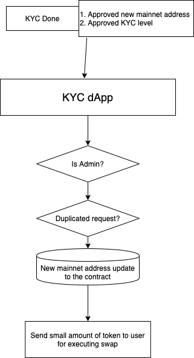
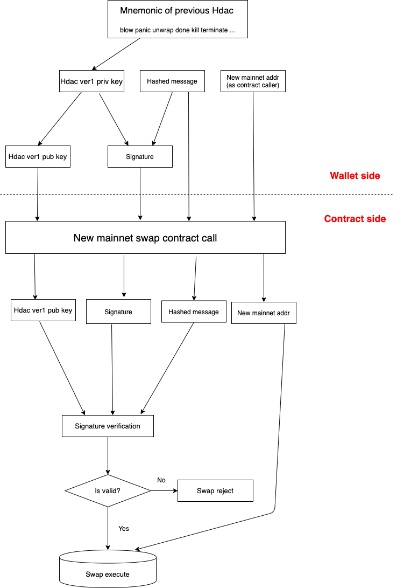

# Process

## 1. After KYC complete

An user has been already registered his KYC information to KYC dApp. Then, admin checks the information and approve it when the information is OK. This process is performed by admin and is for recording KYC COMPLETED information into contract, and send small amount of token for executing swap with ver1 credential.

KYC process will be done with a new mainnet address, not ver1 address. Ver1 address - New mainnet address matching will be done in swap process.

## 2. Swap process

This process can proof of holding both of ver1 and new mainnet at once. This process will be executed by the user with new mainnet credential. The new mainnet address must have been approved in KYC process, and the process can be executed when the user has a little bit amount of tokens as a transaction fare.

New mainnet address will be validated in platform area, and ver1 credential will be validated within contract.

It needs:

- Public key of ver1
- Hashed message of transaction
- Signature made from private key of ver1 and message

And the swap contract validates the credential of ver1 with these parameters. Secp256k1-ECDSA signature validation logic is included with this contract. If the user passes these process and has not execute before, the swap process will be done and the amount of tokens will be transferred into your account.
